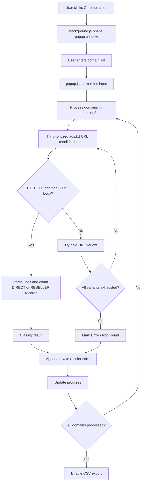

# Mass Ads.txt Checker
>[!NOTE]
>### This project has been merged into **[OstinUA/Mass-Ads-App-Ads-Checker](https://github.com/OstinUA/Mass-Ads-App-Ads-Checker)** and refactored to support a new configuration. Future development and updates will continue in the new repository.

---

Mass Ads.txt Checker is a Chrome Extension for high-volume `ads.txt` discovery, validation, and export workflows used by AdOps teams, publishers, and technical auditors.

[](https://developer.chrome.com/docs/extensions/mv3/)
[](manifest.json)
[](https://iabtechlab.com/ads-txt/)
[](LICENSE)
[](https://github.com/OstinUA/Mass-Ads-Checker)

## Related Projects

This tool is part of the **AdTech Automation Suite**. Check out the companion extension:

| Project | Type | Description |
| :--- | :--- | :--- |
| **[Mass-Ads-Checker](https://github.com/OstinUA/Mass-Ads-Checker)** | Chrome Extension | Mass Ads.txt Checker is a Chrome Extension for high-volume ads.txt validation file |
| **[Mass-App-Ads-Checker](https://github.com/OstinUA/Mass-App-Ads-Checker)** | Chrome Extension | Mass App-Ads.txt Checker is a Chrome Extension for high-volume app-ads.txt validation file |

> [!IMPORTANT]
> This repository currently ships as a browser extension rather than a traditional package-distributed library. The documentation below reflects the implementation that exists in this codebase.

## Table of Contents

- [Features](#features)
- [Tech Stack & Architecture](#tech-stack--architecture)
  - [Core Technologies](#core-technologies)
  - [Project Structure](#project-structure)
  - [Key Design Decisions](#key-design-decisions)
- [Getting Started](#getting-started)
  - [Prerequisites](#prerequisites)
  - [Installation](#installation)
- [Testing](#testing)
- [Deployment](#deployment)
- [Usage](#usage)
- [Configuration](#configuration)
- [License](#license)
- [Contacts & Community Support](#contacts--community-support)

## Features

- Bulk validation of `ads.txt` endpoints for many domains in a single run.
- Client-side execution directly inside Chrome, which helps when origin servers respond differently to browser traffic than to headless scripts or data-center IPs.
- Multi-variant URL resolution with prioritized lookup order:
  - `https://www.<domain>/ads.txt`
  - `https://<domain>/ads.txt`
  - `http://www.<domain>/ads.txt`
  - `http://<domain>/ads.txt`
- Smart domain normalization that strips protocol prefixes, removes trailing slashes, and collapses `www.` before checks begin.
- Timeout-controlled network requests using `AbortController` to avoid indefinitely hanging validation jobs.
- Lightweight HTML-body rejection so generic error pages or anti-bot interstitials are not misclassified as valid `ads.txt` content.
- IAB-oriented line parsing that counts only records whose relationship field resolves to `DIRECT` or `RESELLER`.
- Support for inline comments and BOM-stripped content during line parsing.
- Real-time progress feedback showing completed checks versus total submitted domains.
- Result classification for successful, empty, and failed lookups.
- Clickable resolved `ads.txt` URLs for analyst verification.
- CSV export for downstream spreadsheet analysis or audit handoff.
- Dedicated popup window launch flow from the Chrome toolbar action to reduce accidental tab closure during long-running checks.
- Minimal footprint implementation with no external runtime dependencies.

## Tech Stack & Architecture

### Core Technologies

- **JavaScript (Vanilla):** Implements the Chrome action handler, request orchestration, parsing, DOM updates, and CSV generation.
- **HTML5 + Inline CSS:** Provides a self-contained extension UI without framework dependencies.
- **Chrome Extensions Manifest V3:** Defines the service worker, browser action behavior, and host permissions.
- **Browser Fetch API:** Performs live `ads.txt` retrieval against public publisher domains.
- **Web Platform APIs:** Uses `AbortController`, `Blob`, and `URL.createObjectURL` for request control and export handling.

### Project Structure

```text
Mass-Ads-Checker/
├── LICENSE
├── README.md
├── background.js
├── manifest.json
├── popup.html
├── popup.js
└── icons/
    └── icon128web.png
```

### Key Design Decisions

1. **Browser-native execution over server-side crawling**
   - The extension executes requests from the user’s browser session, which can be materially more reliable for sites guarded by CDN policies, browser fingerprint checks, or basic anti-automation rules.
   - This design avoids maintaining a backend, API key infrastructure, or job queue system.

2. **Sequential batched concurrency**
   - Requests are processed in small batches of two domains at a time.
   - This keeps the UI responsive while reducing the chance of bursty network traffic, tab instability, or rate-limit amplification.

3. **Heuristic validity model**
   - The checker intentionally treats files as useful only when at least one normalized record includes `DIRECT` or `RESELLER` in the relationship column.
   - This favors operationally relevant outputs for monetization audits rather than merely verifying file existence.

4. **Static, dependency-free packaging**
   - The repository contains only first-party assets and source files.
   - This makes the extension easy to inspect, side-load, and review for security-sensitive environments.

5. **Export-first analyst workflow**
   - CSV generation is built into the UI so audit results can move directly into Excel, Google Sheets, or internal QA pipelines.

#### Runtime Flow



#### Component Responsibilities

- `manifest.json`
  - Declares Manifest V3 metadata.
  - Requests `storage` plus broad HTTP/HTTPS host permissions.
  - Registers the background service worker and browser action metadata.
- `background.js`
  - Responds to toolbar clicks.
  - Opens the application UI in a dedicated popup window with fixed dimensions.
- `popup.html`
  - Defines the extension UI, including the domain input, status area, results table, and CSV export button.
- `popup.js`
  - Orchestrates validation batches.
  - Normalizes domain input.
  - Executes network requests.
  - Parses `ads.txt` content.
  - Renders results and exports CSV.

> [!IMPORTANT]
> Because the extension requests `http://*/*` and `https://*/*` host permissions, users should install it only from a trusted source and review the code before internal distribution.

## Getting Started

### Prerequisites

You need the following to run the project locally:

- **Google Chrome** or another Chromium-based browser with Chrome Extension compatibility.
- **Git** for cloning the repository.
- **Node.js** only if you want to run the optional JavaScript syntax checks shown in the testing section.
- A network environment that permits direct outbound requests to publisher domains over HTTP and HTTPS.

### Installation

1. Clone the repository:

```bash
git clone https://github.com/<your-org>/Mass-Ads-Checker.git
cd Mass-Ads-Checker
```

2. Open the Chrome extensions management page:

```text
chrome://extensions/
```

3. Enable **Developer mode**.
4. Click **Load unpacked**.
5. Select the cloned repository folder.
6. Pin the extension if you want faster toolbar access.
7. Click the extension icon to open the dedicated checker window.

> [!TIP]
> Since this is a static extension, there is no package installation step such as `npm install`. Loading the unpacked directory is sufficient.

## Testing

The repository does not currently include an automated unit or integration test suite. Validation is primarily performed through static syntax checks plus browser-based manual smoke testing.

### Static Checks

Validate the manifest JSON structure:

```bash
python3 -m json.tool manifest.json >/dev/null
```

Validate JavaScript syntax:

```bash
node --check background.js
node --check popup.js
```

### Manual Smoke Test

1. Load the unpacked extension in Chrome.
2. Click the toolbar icon to open the popup window.
3. Paste a list of test domains, for example:

```text
nytimes.com
cnn.com
example.com
```

4. Run a check and verify:
   - Progress increments as domains complete.
   - Successful rows show a clickable `ads.txt` URL.
   - Domains with no valid records are classified as `Empty File`.
   - Unreachable or missing files are classified as `Error / Not Found`.
5. Click **Download CSV** and confirm the generated file contains the expected headers and row data.

### Suggested Future Test Coverage

If you extend the project, the most valuable next additions are:

- Parser unit tests for `countValidLines()` edge cases.
- Input normalization tests for protocol and subdomain handling.
- Mocked fetch integration tests for URL fallback behavior.
- UI regression checks for table rendering and CSV export.

> [!WARNING]
> Network-dependent validation results can vary by geography, CDN policy, publisher firewall rules, and transient outages. Manual tests should use a representative set of known-good and known-bad domains.

## Deployment

Because the project is a browser extension, deployment typically means packaging it for internal distribution or publishing it via an extension store workflow.

### Local Production Build

There is no transpilation or bundling stage. A production artifact can be created by packaging the repository contents directly.

Example release archive command:

```bash
zip -r mass-ads-checker.zip manifest.json background.js popup.html popup.js icons LICENSE README.md
```

### Internal Distribution

- Distribute the unpacked folder to trusted analysts for local side-loading.
- Or distribute a versioned ZIP artifact through your internal software catalog.
- For managed enterprise environments, use Chrome policy-based extension deployment if your organization already manages browser configuration centrally.

### CI/CD Recommendations

A lightweight CI pipeline for this repository should include:

1. JSON validation for `manifest.json`.
2. JavaScript syntax validation for all `.js` files.
3. Optional linting if you later introduce ESLint.
4. Packaging of a release ZIP artifact.
5. Optional checksum generation for internal provenance tracking.

Minimal CI verification commands:

```bash
python3 -m json.tool manifest.json >/dev/null
node --check background.js
node --check popup.js
zip -r mass-ads-checker.zip manifest.json background.js popup.html popup.js icons LICENSE README.md
```

> [!CAUTION]
> Publishing to the Chrome Web Store may require additional metadata, screenshots, store assets, privacy disclosures, and compliance review that are not part of this repository.

## Usage

### Launch the Extension

1. Click the extension action in Chrome.
2. A standalone popup window opens.
3. Paste one domain per line into the textarea.
4. Click **Run Check**.
5. Review status, resolved URL, and valid line count.
6. Export results as CSV when processing completes.

### Example Input

```text
nytimes.com
https://cnn.com
www.theguardian.com/
example.com/path
```

### Processing Logic Example

```javascript
// User-provided input is normalized before any network request is sent.
const rawDomain = 'https://www.example.com/path';
const domain = rawDomain
  .replace(/^(https?:\/\/)?(www\.)?/, '')
  .replace(/\/$/, '')
  .split('/')[0];

const urls = [
  `https://www.${domain}/ads.txt`,
  `https://${domain}/ads.txt`,
  `http://www.${domain}/ads.txt`,
  `http://${domain}/ads.txt`
];

// The extension tries each candidate until it finds a 200 response
// with a non-HTML body, then counts valid DIRECT/RESELLER entries.
```

### Result Semantics

- **Valid**
  - The target responded successfully.
  - At least one parsed record contained `DIRECT` or `RESELLER` in the relationship field.
- **Empty File**
  - A valid `ads.txt` resource was retrieved, but no qualifying lines were found.
- **Error / Not Found**
  - No candidate URL returned a usable `ads.txt` payload.

### CSV Output Format

The generated CSV contains the following header row:

```csv
Ads.txt URL,Status,Lines
```

Rows use the resolved `ads.txt` URL when available; otherwise the original domain value is emitted in the first column.

## Configuration

The project does not currently use `.env` files, startup flags, or user-editable JSON/YAML configuration. Behavior is controlled by the extension manifest plus a few implementation constants in `popup.js`.

### Manifest Configuration

| Key | Current Value | Purpose |
| --- | --- | --- |
| `manifest_version` | `3` | Uses Chrome Extensions Manifest V3. |
| `name` | `Mass Ads.txt Checker` | Display name shown in Chrome. |
| `version` | `2.1` | Extension version identifier. |
| `description` | `Check list of domains for ads.txt validity` | Short extension summary. |
| `permissions` | `storage` | Reserved extension API permission. |
| `host_permissions` | `http://*/*`, `https://*/*` | Allows fetching `ads.txt` from arbitrary hosts. |
| `background.service_worker` | `background.js` | Registers the background click handler. |
| `action.default_title` | `Open Checker` | Tooltip shown on the extension action. |
| `action.default_icon` | `icons/icon128web.png` | Toolbar icon. |
| `icons` | `icons/icon128web.png` | Extension icon metadata. |

### Runtime Constants

| Location | Current Value | Effect |
| --- | --- | --- |
| `popup.js` | `batchSize = 2` | Controls concurrent request volume. |
| `popup.js` | `20000` ms timeout | Aborts slow requests after 20 seconds. |
| `popup.js` | URL candidate order | Prioritizes HTTPS and `www` before HTTP fallbacks. |
| `popup.js` | `DIRECT` / `RESELLER` filter | Determines what counts as a valid monetization line. |
| `background.js` | `width: 900`, `height: 800` | Controls popup window dimensions. |

### Operational Considerations

- Increasing the batch size may improve throughput but can also raise the probability of rate-limits, noisy failures, or degraded browser responsiveness.
- Reducing the timeout improves turnaround for unreachable domains but can misclassify slow servers as failures.
- Broad host permissions are operationally necessary for mass checking, but they also increase the trust profile of the extension.
- The parser is intentionally conservative and ignores records that do not expose a third comma-separated field resolving to `DIRECT` or `RESELLER`.

> [!NOTE]
> If you want environment-driven or UI-driven configuration in the future, the most natural next step is to store user preferences with `chrome.storage` and expose them as popup settings.

## License

This project is licensed under the **MIT License**. See [`LICENSE`](LICENSE) for the full text.

## Contacts & Community Support

## Support the Project

[](https://www.patreon.com/OstinFCT)
[](https://ko-fi.com/fctostin)
[](https://boosty.to/ostinfct)
[](https://www.youtube.com/@FCT-Ostin)
[](https://t.me/FCTostin)

If you find this tool useful, consider leaving a star on GitHub or supporting the author directly.
